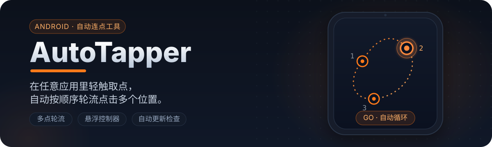

  

## AutoTapper 是什么

AutoTapper 是一个 Android 自动连点工具。它通过**无障碍服务**执行点击手势，通过**悬浮控制器**在任意应用里完成取点、开始点击和停止点击。

与只能固定一个点连点的工具不同，AutoTapper 支持**多个点位按顺序轮流点击**，适合需要在屏幕多个位置反复操作的场景。

## 功能特性

- **多点轮流点击**：按点位顺序循环点击，当前点位会闪烁高亮
- **悬浮控制器**：常驻侧边，悬浮球可拖动；`+` 连续取点、`DEL` 删点、`GO` 开始、`STOP` 停止
- **半透明点位标记**：屏幕上以橘色圆点标记每个点击位置
- **灵活的点击节奏**：基础间隔、随机附加延迟、固定轮数 / 无限轮数
- **自动更新检查**：启动后静默检测 GitHub 最新版本，发现新版本自动提醒
- **主界面点位列表**：可逐条查看和删除点位，旧版单点配置会自动迁移

## 快速开始

1. 从 [Releases](https://github.com/YangZiyueZY/AutoTapper/releases/latest) 下载并安装 APK。
2. 打开应用，依次授予**悬浮窗权限**与**无障碍服务**（点击“去授权”）。
3. 点击“打开悬浮控制器取点”，在屏幕各处轻触添加点位，完成后退出取点。
4. 展开侧边悬浮控制器，点击 `GO` 开始自动点击；需要停止时点击 `STOP`。

  

## 工作原理

1. **取点**：悬浮控制器进入取点模式，轻触屏幕把每个位置记为一个点位。
2. **配置**：设置基础间隔（每次点击之间至少等待多久）、随机附加延迟（在间隔上额外随机增加时长）、点击轮数（每轮把每个点位各点一次，`0` 表示一直点击到手动停止）。
3. **开始**：点击 `GO` 或主界面的“开始点击”，无障碍服务依次在记录好的点位上触发点击手势。
4. **循环点击**：按点位顺序轮流点击，当前正在点击的点位会闪烁高亮。
5. **更新提醒**：应用启动后自动检查 GitHub 最新版本，发现新版本会弹窗并发送系统通知。

### 点击配置说明

| 配置项 | 说明 | 建议 |
| --- | --- | --- |
| 基础间隔 | 两次点击之间至少等待的毫秒数 | 300–800，低于 100 会按 100 处理 |
| 随机附加延迟 | 在基础间隔之外随机增加 0 到该值的等待 | 0 表示固定节奏 |
| 点击轮数 | 完整跑几轮（每个点位每轮各点一次） | 1 = 各点 1 次，0 = 无限 |

## 悬浮控制器说明

悬浮球默认收在屏幕侧边，**可以按住拖动**调整位置。

- `+`：连续添加点击点
- `DEL`：删除最后一个点击点
- `GO`：开始点击
- `STOP`：停止点击

展开时显示半透明橘色点位标记；点击进行中，正在点击的圆点会闪烁高亮。收起时标记自动隐藏，不挡屏幕内容。

## 使用提醒

- AutoTapper 不会因你开启无障碍服务就自动点击，只有你手动点击 `GO` 或“开始点击”时才会执行。
- 请只在你明确知情并允许的场景下使用；不建议用于违反平台规则、规避风控或影响他人服务的行为。
- 第一次使用建议先在不重要的界面测试参数。

## 已知限制

- 不支持滑动手势。
- 不支持复杂动作编排。

## 更新日志

完整更新记录见 [CHANGELOG.md](./CHANGELOG.md)。
